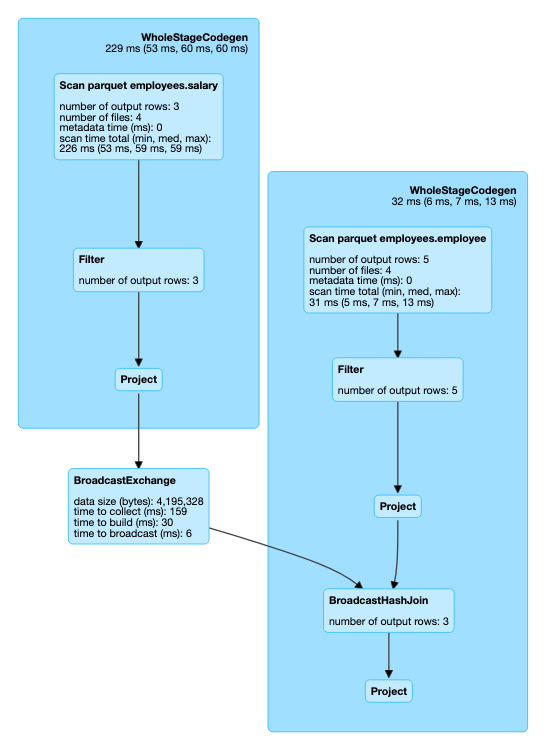

## Spark SQL

## Spark SQL Pipeline
Spark SQL pipeline mainly categories into 4 parts
1. [Query Parsing](#query-parsing)
2. [Logical Planning](#logical-planning)
3. [Query Optimization](#query-optimization)
4. [Physical Planning & Execution](#physical-planning-&-execution)


Spark perform various operations to convert given SQL query into RDD (Resilient Distributed Dataset).

Lets prepare our table. We will query against this table

#### Salary Table

| name   |  salary  |   
|------- |--------- |
| tom    | 80,000   |
| bob    | 50,000   |
| alice  | 180,000  |
| james  | 160,050  | 
| steve  | 250,000  |

#### Employee Table

|  name  |  department |
|--------|-------------|
|  tom   |  Accounting |
|  bob   |  Legal      |
| alice  |  IT         |
| james  |  Legal      |
| steve  |  Legal      |

Lets say, we want to find all people and their department name who earns more than 100,000.

This translate to following query.
```
select 
   s.name, e.department 
from salary s, employee e 
where 
   salary > 100000 
   and s.name = e.name 
```
Lets run this query through spark sql

Before spark perform any operation it simply convert sql code into data frame.

### Query Parsing
During this stage, spark will parse the query and create a tree like structure for us. Spark uses Catalyst parser
 internally. This enable spark to validate the syntax of query and extract various part of query such projected
  fields, table, database, filter conditions and joins. This way spark generates Unresolved Plan
```
== Parsed Logical Plan ==
Project [name#14, department#21]
+- Filter ((salary#15 > 100000) && (name#14 = name#20))
   +- Join Inner
      :- SubqueryAlias `s`
      :  +- SubqueryAlias `employees`.`salary`
      :     +- Relation[name#14,salary#15] parquet
      +- SubqueryAlias `e`
         +- SubqueryAlias `employees`.`employee`
            +- Relation[name#20,department#21] parquet
```

### Logical Planning
In this phase, spark will read parsed query and with the help of Catalog it resolve attributes of the query such as
identifying database of required table in query. All the projected field types and filter condition types. During
this phase spark also determines how to read certain underlying files and their location. If this table is managed
by external catalog such as Hive then spark will determine all these information from Hive metastore. 
(Note: AWS Glue is an example of external Hive meta store) This metastore persists metadata about tables.
Spark uses Catalyst Analyzer during this phase. Its job is to simply resolve names of attributes in SQL query using
information present in table. In simple  At the end of this stage spark generates resolved logical plan. 

```
== Analyzed Logical Plan ==
name: string, department: string
Project [name#14, department#21]
+- Filter ((salary#15 > 100000) && (name#14 = name#20))
   +- Join Inner
      :- SubqueryAlias `s`
      :  +- SubqueryAlias `employees`.`salary`
      :     +- Relation[name#14,salary#15] parquet
      +- SubqueryAlias `e`
         +- SubqueryAlias `employees`.`employee`
            +- Relation[name#20,department#21] parquet

```

### Query Optimization
During this phase, spark will applies set of rules and generates optimized plan. Analyzed Logical plan is represented
as tree internally in spark. Spark Optimizer read through tree and run a batches of rules. Each rule will try to
optimize and generate a new tree. At the end we will have optimized logical plan.

```
== Optimized Logical Plan ==
Project [name#14, department#21]
+- Join Inner, (name#14 = name#20)
   :- Project [name#14]
   :  +- Filter ((isnotnull(salary#15) && (salary#15 > 100000)) && isnotnull(name#14))
   :     +- Relation[name#14,salary#15] parquet
   +- Filter isnotnull(name#20)
      +- Relation[name#20,department#21] parquet

``` 

### Physical Planning & Execution
Spark now reads optimized logical plan and generate set of physical plans. [SparkStrategies]()
Physical plan actually translate the requested operations into RDD operations and execute them on executors. 
After aset of physical plans are generate spark evaluate them based on cost and pick the cheapest one. These cost are
calculated using various statistics information available from meta store. Some of these statistics include total
size of table, max, min value of columns, number of rows etc. Spark uses these information to improvise runtime.
For example if our query is performing a join on two tables A and B.
Size of table A is 10 mb and table B is 1 TB. Since we can easily store table A in memory and broadcast it to all
executors. This will speed up our query execution due to map side join over sort merge joins.
Once cheapest Physical plan is identified spark begins the execution and generate output.

```
== Physical Plan ==
*(2) Project [name#14, department#21]
+- *(2) BroadcastHashJoin [name#14], [name#20], Inner, BuildLeft
   :- BroadcastExchange HashedRelationBroadcastMode(List(input[0, string, true]))
   :  +- *(1) Project [name#14]
   :     +- *(1) Filter ((isnotnull(salary#15) && (salary#15 > 100000)) && isnotnull(name#14))
   :        +- *(1) FileScan parquet employees.salary[name#14,salary#15]
   :                Batched: true, 
   :                Format: Parquet, 
   :                Location: InMemoryFileIndex[file:/Users/jalpan/spark-2.4.4/spark-warehouse/employees.db/salary],
   :                PartitionFilters: [], 
   :                PushedFilters: [IsNotNull(salary), GreaterThan(salary,100000), IsNotNull(name)], 
   :                ReadSchema: struct<name:string,salary:int>
   +- *(2) Project [name#20, department#21]
      +- *(2) Filter isnotnull(name#20)
         +- *(2) FileScan parquet employees.employee[name#20,department#21] 
         :       Batched: true, 
         :       Format: Parquet, 
         :       Location: InMemoryFileIndex[file:/Users/jalpan/spark-2.4.4/spark-warehouse/employees.db/employee], 
         :       PartitionFilters: [], 
         :       PushedFilters: [IsNotNull(name)], 
         :       ReadSchema: struct<name:string,department:string>
```

### Execution DAG


Now we have high level idea and what happens under the hood on each stage. 
Lets dive little deeper into physical plan execution

## Physical plan execution
During the physical plan execution spark perform 2 basic operations. 
1. File System Listing (Find all the candidate files where data is located)
2. Record Reading (Read all files and generate output)

Spark provide 3 different ways of physical plan execution
1. [Hive Mode (a.k.a. File Input Format API)](../spark-sql/hive.md)
2. [Datasource Mode (a.k.a Datasource v1 API)](../spark-sql/dsv1.md)
3. [Datasource V2 Mode](../spark-sql/dsv2.md)

We will look into each of this mode [Next](../spark-sql/hive.md)